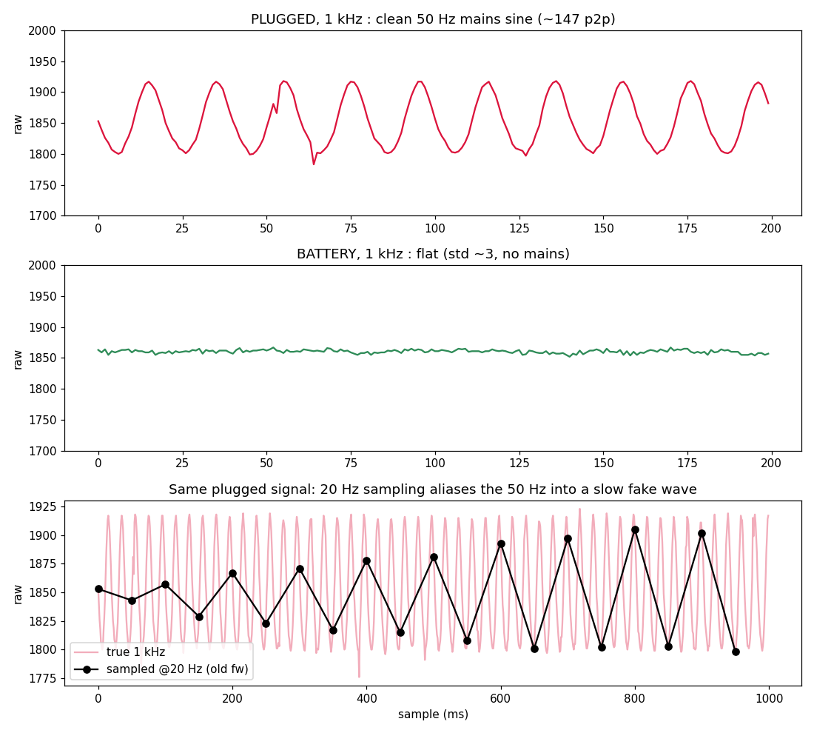
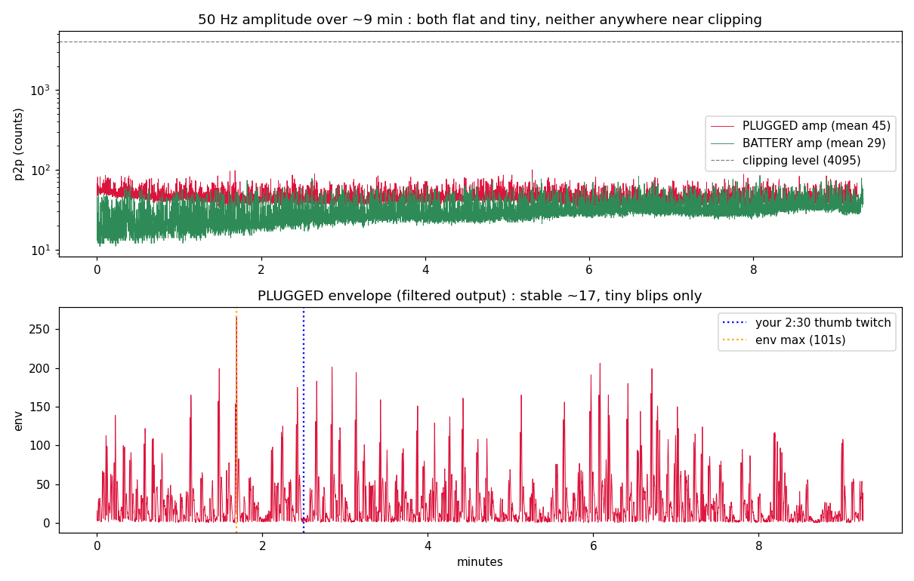
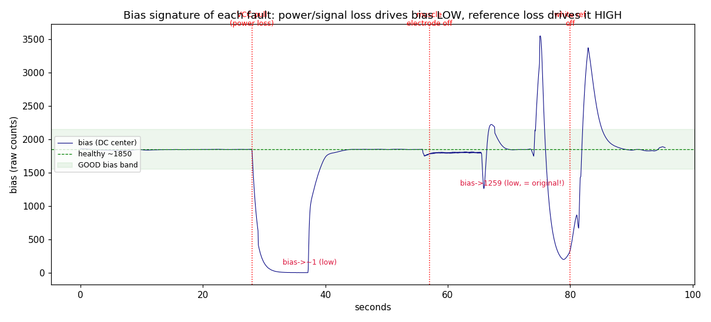

# EMG Signal: Noise and Fault Findings

Bench characterization of the Grove EMG front end on the Nucleo-F446RE (June 2026).
Signal captured at 1 kHz and processed on-device (adaptive bias, 50 Hz notch, envelope),
logged over serial. Raw logs are in `data/`, plots are referenced inline.

`p2p` = peak-to-peak swing amplitude in ADC counts (max minus min within a window). It is
an amplitude, not a frequency.

## Setup

- Sensor: Grove EMG Detector (analog, internally amplified, outputs a biased AC signal
  centered near 1.5 V, not a pre-smoothed envelope).
- Electrodes: red + black on the palmaris longus (forearm), white reference on the wrist.
- ADC: PA0 (Arduino A0), 12-bit, sampled at 1 kHz by a TIM2 interrupt.
- Sensor powered from 3V3 (caps its output below the ADC's 3.3 V ceiling; PA0 is not
  5 V tolerant).

## Finding 1: the plugged-in noise is 50 Hz mains

Plugged into the wall, the relaxed baseline carries a clean ~50 Hz sine (confirmed by
zero-crossing count). On battery it is flat. Cause: the laptop's earth connection couples
mains common-mode into the body and electrodes.

Top: plugged 50 Hz sine. Middle: battery flat. Bottom: the same plugged signal sampled at
20 Hz, showing why slow sampling hid the problem (aliasing turns 50 Hz into a slow fake wave).

## Finding 2: plugged-in is usable with good electrode contact

Over 9 minutes plugged and relaxed, amplitude held ~45 counts (full scale is 4095) with
ZERO clipping. The earlier rail-to-rail failure was a bad-connection moment, not the norm.
The dominant variable is electrode-contact quality (common-mode rejection), not random
external mains. Battery is cleaner still, but tethered development is fine with solid contact.

## Finding 3: electrode settling drift (first ~10 to 15 minutes)

Amplitude is not constant right after applying electrodes. Fresh electrodes: amplitude rose
from ~22 to ~36 counts over 9 minutes (battery run). A run 14 minutes later was flat at ~44.
The skin-electrode impedance drops as the gel hydrates the skin, improving coupling and
raising the picked-up amplitude until it plateaus. This is not caused by laptop battery
level (the rise is a one-time decelerating settle, not correlated with charge).

Practical rule: let the electrodes settle ~10 minutes before calibrating gesture thresholds,
or the thresholds drift as the signal grows.

## Finding 4: fault signatures and the warning system

Deliberately induced faults each have a distinct DC-bias fingerprint:

| Fault | bias behavior |
|---|---|
| VCC (power) loss | output falls to ground, bias crashes toward 0 |
| Signal electrode (red/black) loss | bias drags low (~1250) |
| Reference (white) loss | bias rails high (~2500 to 4000) |

The earlier "bias = 1200" mystery matches signal-side or power-side loss (a partially seated
3V3 jumper, or a muscle electrode losing contact), NOT the reference and NOT external
interference. Touching ground/wall/laptop/charger, manhandling the leads, and moving a hand
near them produced no measurable effect.

A health monitor flags clipping, excess amplitude, or bias out of range, lights LD2, and
auto-captures the raw waveform on fault. Validated against all induced faults. This is the
Phase 7 failsafe foundation.

## On-device pipeline

adaptive bias removal (tracks the DC center live, not hardcoded) then 50 Hz notch biquad
(removes mains on the linear signal, before rectification) then rectify then moving-average
envelope. The notch coefficients are ratio-based: the same values retarget to 60 Hz in
Canada by sampling at 1200 Hz and keeping the 20-sample window.

## Data

- `data/scope_plugged_relaxed.log`, `data/scope_battery_relaxed.log`: 1 kHz raw waveform dumps.
- `data/10min_plugged.log`, `data/10min_battery.log`: long-run amplitude / envelope logs.
- `data/fault_test_vcc_electrode.log`: timed VCC and electrode-removal fault test.
